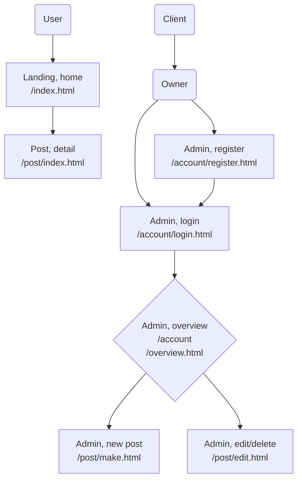

# Project Exam 1

## Description
This project was developed for a school exam. The objective was to create a front-end user interface for an existing API blogging application for a client, HotView Labs. It's a responsive application that allows users to view blog posts. Additionally, there's an admin page for the owner to register, log in, and manage their blog posts.

[Website](https://anna-skudsveen-project-exam1.netlify.app/)

[Figma file](https://www.figma.com/design/iwm2yt2TfuKaHf5iic2Tow/Project-Exam-1?node-id=1-9&t=3dOHjK1AYfBmzKeX-1)

## Technologies
JS

HTML

CSS

## Project Roadmap
While I am happy about the project, I would love to further enhance the user experience, and add more and better user feedback. Search, filter and sort functions would also be great moving forward.

## Plans
[FigJam board](https://www.figma.com/board/d33EUlTGVsuDs9HFsSo9Jf/Project-Exam-1---Figjam?node-id=0-1&t=ZwkSv96Svz6xNCAY-1)

#### User flow

## License
This project is licensed under the MIT License - see the LICENSE.md file for details
